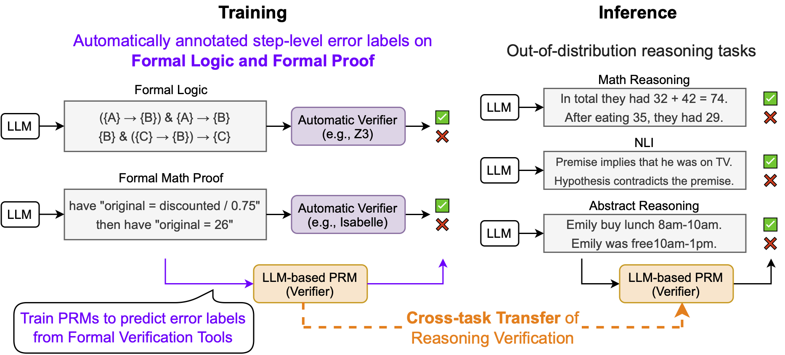
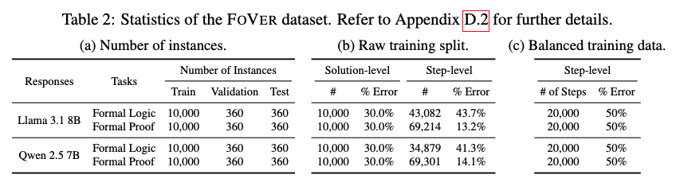

# FoVer

<p align="center">
<a href="https://fover-prm.github.io/">Project Website</a> | 📄 <a href="https://arxiv.org/abs/">Paper</a> | 🛠️ <a href="https://github.com/psunlpgroup/FoVer">GitHub</a> | 🤗 <a href="https://huggingface.co/collections/ryokamoi/fover-682e28cc9f6200c7dfd5342f">Dataset</a> | 🤗 <a href="https://huggingface.co/collections/ryokamoi/fover-682e28cc9f6200c7dfd5342f">Models</a>
</p>

This repository includes code and materials for the paper "Training Step-Level Reasoning Verifiers with Formal Verification Tools".

Please refer to [Quick Start](#quick-start) for a quick start guide to evaluate your models on the FoVer dataset or evaluate the FoVer models on your dataset.

* GitHub: [https://github.com/psunlpgroup/FoVer](https://github.com/psunlpgroup/FoVer)
* FoVer Dataset
  * Raw datasets (including the training, validation, and test splits)
    * [ryokamoi/FoVer-FormalLogic-Llama-3.1-8B](https://huggingface.co/datasets/ryokamoi/FoVer-FormalLogic-Llama-3.1-8B)
    * [ryokamoi/FoVer-FormalProof-Llama-3.1-8B](https://huggingface.co/datasets/ryokamoi/FoVer-FormalProof-Llama-3.1-8B)
    * [ryokamoi/FoVer-FormalLogic-Qwen-2.5-7B](https://huggingface.co/datasets/ryokamoi/FoVer-FormalLogic-Qwen-2.5-7B)
    * [ryokamoi/FoVer-FormalProof-Qwen-2.5-7B](https://huggingface.co/datasets/ryokamoi/FoVer-FormalProof-Qwen-2.5-7B)
  * Balanced datasets for training (including training data only)
    * [ryokamoi/FoVer-FormalLogic-FormalProof-Llama-3.1-8B-LastStepBalanced-40k](https://huggingface.co/datasets/ryokamoi/FoVer-FormalLogic-FormalProof-Llama-3.1-8B-LastStepBalanced-40k)
    * [ryokamoi/FoVer-FormalLogic-FormalProof-Qwen-2.5-7B-LastStepBalanced-40k](https://huggingface.co/datasets/ryokamoi/FoVer-FormalLogic-FormalProof-Qwen-2.5-7B-LastStepBalanced-40k)

* FoVer PRMs
  * [ryokamoi/Llama-3.1-8B-FoVer-PRM](https://huggingface.co/ryokamoi/Llama-3.1-8B-FoVer-PRM)
  * [ryokamoi/Qwen-2.5-7B-FoVer-PRM](https://huggingface.co/ryokamoi/Qwen-2.5-7B-FoVer-PRM)

* Other materials, including variants of the datasets and intermediate outputs
  * [ryokamoi/FoVer-misc](https://huggingface.co/datasets/ryokamoi/FoVer-misc)


```bibtex
@unpublished{kamoi2025fover,
  title  = {Training Step-Level Reasoning Verifiers with Formal Verification Tools},
  author = {Ryo Kamoi and Yusen Zhang and Nan Zhang and Sarkar Snigdha Sarathi Das and Rui Zhang},
  year   = {2025},
}
```

## Introduction

Process reward models (PRMs), which provide step-by-step feedback on the reasoning generated by large language models (LLMs), are receiving increasing attention for their potential to enhance LLMs via reinforcement learning and inference-time refinement.

We propose FoVer, an approach for training PRMs on step-level error labels that are automatically annotated using formal verification tools (e.g., Z3, Isabelle). We introduce a dataset that includes automatically annotated step-level error labels on LLM responses for the formal logic and proof tasks. We demonstrate that LLM-based PRMs trained on the FoVer dataset exhibit cross-task transfer of verification capabilities learned in formal logic and proof, leading to improved verification across a broad range of reasoning tasks, including mathematics, academic problems, logic, and abstract reasoning.

<div align="center"></div>


## Setup

To run our PRMs:

* torch==2.6.0
* transformers==4.50.3

Please refer to [setup/setup.sh](https://github.com/psunlpgroup/FoVer/setup/setup.sh) for details. We use different environments for dataset creation, training, and evaluation.

We run our experiments on the following environment. You might need to modify configulations if you are using a different environment.

* Four NVIDIA A100 SXM4 80GB GPUs
* CUDA Version: 12.2

## Quick Start

### Evaluate Your PRM on the FoVer Datasets

The FoVer dataset is initially designed to train models, but our test splits also serves as an evaluation benchmark for PRMs. Our dataset provides the following information. Please refer to [FoVer Dataset](#fover-dataset) for details of other items in our dataset.

```json
{
    "problem": """Based on the provided facts ($context$), either prove or disprove the hypothesis or state that it is unknown. The facts and the hypothesis are written in logical formulas as follows: capital letters such as "{A}", "{B}", "{AB}" are predicates, small letters such as "{a}", "{b}", "{ab}" are constants, "&" is logical conjunction, "v" is logical disjunction, "¬" is negation, "->" is implication, "(x)" is "for all x", and "(Ex)" is "for some x".\n\n$hypothesis$: ¬{A}\n\n$context$:\nfact1: {IN}\nfact2: {BH}\nfact3: {EE}\nfact4: ¬{B} -> ({A} & {FH})\nfact5: {CA}\nfact6: {GO}\nfact7: {IR}\nfact8: {HH}\nfact9: {JI}\nfact10: {AN}\nfact11: {C} -> ({B} & ¬{A})\nfact12: {HP}\nfact13: {GK}\nfact14: {JC}\nfact15: ¬{E} -> ({C} & {D})\nfact16: {T}\nfact17: {H}\nfact18: {AF}""",
    "solution_steps": [
        "fact11 -> int1: {B} & ¬{A}",
        "int1 -> int2: ¬{A}",
        "The final answer is PROVED"
    ],
    "error_labels": [false, true, true]
}
```

You can access our dataset from Hugging Face Hub.

```python
from datasets import load_dataset

dataset = load_dataset("ryokamoi/FoVer-FormalLogic-Qwen-2.5-7B", split="validation")

print(dataset[0].keys())
# dict_keys(['id', 'problem', 'solution_steps', 'error_labels',
# 'problem_witout_definition', 'messages', 'base_dataset',
# 'messages_for_prediction', 'hypothesis_formula', 'facts_formula'])

print(dataset[0]['error_labels'])
# [True, True, True, True, True, False, True, False]
```

### Evaluate the FoVer PRMs on Your Dataset

Here is the minimum example to run FoVer PRMs. Please clone our GitHub repository to use the post-processing functions.

```python
from transformers import AutoTokenizer, AutoModelForCausalLM
from src.prm.preprocessing import get_fover_input_format
from src.prm.postprocessing import extract_fover_scores

# ryokamoi/Qwen-2.5-7B-FoVer-PRM or
# ryokamoi/Llama-3.1-8B-FoVer-PRM
prm_name = "ryokamoi/Qwen-2.5-7B-FoVer-PRM"

tokenizer = AutoTokenizer.from_pretrained(prm_name)
model = AutoModelForCausalLM.from_pretrained(prm_name).to("cuda")

# Get input format for the FoVer PRM
conversation = get_fover_input_format(
    problem="Calculate (1+1)*(1+2)",
    solution_steps=["1+1=2", "1+2=3", "2*3=8"],
)
inputs = tokenizer.apply_chat_template(
    conversation, return_tensors="pt").to("cuda")

# Generate the step-level scores
output = model(inputs)

# extract the step-level scores
scores = extract_fover_scores(
    tokenized_prompt=inputs[0].cpu().numpy(),
    logits=output.logits[0],
    tokenizer=tokenizer,
)

print(scores)
# [0.9099470376968384, 0.9997847676277161, 0.012338237836956978]
```

We also provide a script to evaluate the FoVer PRMs on your dataset.

First, convert your dataset into a JSONL file whose rows are in the following format and put at [quickstart/dataset/testdata.jsonl](https://github.com/psunlpgroup/FoVer/quickstart/dataset/testdata.jsonl).

```json
{"problem": "this is a problem.", "solution_steps": ["first step (correct)", "second step (wrong)", "third step (unknown)"], "error_labels": [true, false, null]}
```

Then, run the following command to evaluate the PRM on your dataset. We use the minimum step-level score as an instance-level score by default.

```bash
python quickstart/evaluate.py \
    --fover_prm_name ryokamoi/Qwen-2.5-7B-FoVer-PRM \
    --dataset_dir quickstart/dataset/test_data \
    --output_dir quickstart/results/
```

You will get the following outputs.

* `quickstart/results/testdata/performance.json`
  * The performance metrics of the FoVer PRM on your dataset.
  * The step-level and instance-level scores by the FoVer PRM on your dataset.

## FoVer Dataset

We provide the FoVer datasets that include the mistakes made by Llama 3.1 8B and Qwen 2.5 7B on formal logic and proof tasks.

### Dataset Format

Each instance of the FoVer datasets include the following items.

* `problem` (str)
* `solution_steps` (list[str])
  * The solution steps generated by the model.
* `error_labels` (list[str])
  * The ground-truth error labels generated by the error verification tools (Z3, Isabelle)
* `messages` (list[dict[str, str]])
  * The conversation we use for fine-tuning our PRMs.
* `messages_for_prediction` (list[dict[str, str]])
  * The conversation we use for prediction. The model outputs are dummy values and all `correct`.
* `problem_witout_definition` (str)
  * The `problem` without task definition (metadata, not used in our experiments).

### Dataset Statistics

<div align="center"></div>

### LastStepBalanced Dataset

We create the LastStepBalanced dataset to train PRMs on the balanced dataset where the last step includes 50% of correct and 50% of incorrect steps. We truncate solutions to make the last step balanced, so we expect to mask all steps but the last step to train the PRMs.

Specificlaly, we use [Llama-Factory](https://github.com/hiyouga/LLaMA-Factory) with the option `mask_history: true`.

### Creating Training Data for New Models

You can create mistakes made by stronger models to make a better training dataset. Please refer to [run/01_dataset_creation](run/01_dataset_creation) for the dataset creation process. You may need to update our code to support other models.

## Reproducing the Experiments in the Paper

You can refer to shell files in the [run](run) directory to reproduce the experiments in our paper.

You do not need to run the code if you are only interested in using our models or datasets. Please refer to [Quick Start](#quick-start).

## License

Please refer to the [LICENSE.md](https://github.com/psunlpgroup/FoVer/LICENSE.md) file for the license of this repository.
