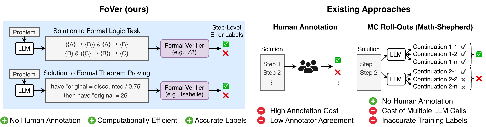

# FoVer

<p align="center">
<a href="https://fover-prm.github.io/">Project Website</a> | 📄 <a href="https://arxiv.org/abs/2505.15960">Paper</a> | 🛠️ <a href="https://github.com/psunlpgroup/FoVer">GitHub</a> | 🤗 <a href="https://huggingface.co/collections/ryokamoi/fover-682e28cc9f6200c7dfd5342f">Models</a>
</p>

This repository includes code and materials for the paper "Efficient PRM Training Data Synthesis via Formal Verification" (ACL 2026 Findings).

* GitHub: [https://github.com/psunlpgroup/FoVer](https://github.com/psunlpgroup/FoVer)
* FoVer PRMs
  * [ryokamoi/Llama-3.1-8B-FoVer-PRM-2026](https://huggingface.co/ryokamoi/Llama-3.1-8B-FoVer-PRM-2026)
  * [ryokamoi/Qwen-2.5-7B-FoVer-PRM-2026](https://huggingface.co/ryokamoi/Qwen-2.5-7B-FoVer-PRM-2026)

```bibtex
@inproceedings{kamoi2026fover,
  title   = {Efficient PRM Training Data Synthesis via Formal Verification},
  author  = {Ryo Kamoi and Yusen Zhang and Nan Zhang and Sarkar Snigdha Sarathi Das and Ranran Haoran Zhang and Wenpeng Yin and Rui Zhang},
  year    = {2026},
  booktitle = {Findings of the Association for Computational Linguistics: ACL 2026},
}
```

## Introduction

Process Reward Models (PRMs) have emerged as a promising approach for improving LLM reasoning capabilities by providing process supervision over reasoning traces. However, existing approaches for constructing PRM training data remain costly and noisy, as they typically rely on human annotation or sampling-based labeling methods that require repeated LLM calls.

In this work, we propose FoVer, a framework that synthesizes PRM training data from formal reasoning tasks by annotating step-level error labels using formal verification tools such as Z3 and Isabelle. By leveraging formal verification, FoVer enables efficient and accurate PRM data construction without requiring human annotation or additional LLM calls. Using FoVer, we create PRM training data from formal logic and theorem proving tasks.

Experiments on 12 reasoning benchmarks show that fine-tuning on our training data improves PRMs not only on math and logic reasoning tasks, which are informal variants of the training tasks, but also on NLI and BBH benchmarks, which differ substantially from the tasks used to construct the training data. These results demonstrate the practical effectiveness of FoVer, showing that PRM training data created using formal verification improves PRMs on informal reasoning tasks written in natural language.

<div align="center"></div>


## Setup

To run our PRMs:

* torch==2.6.0
* transformers==4.50.3

Please refer to [setup/setup.sh](https://github.com/psunlpgroup/FoVer/setup/setup.sh) for details. We use different environments for dataset creation, training, and evaluation.

We run our experiments on the following environment. You might need to modify configulations if you are using a different environment.

* Four NVIDIA A100 SXM4 80GB GPUs
* CUDA Version: 12.2

## FoVer PRMs

```python
from transformers import AutoTokenizer, AutoModelForCausalLM
from src.prm.preprocessing import get_fover_input_format
from src.prm.postprocessing import extract_fover_scores

# ryokamoi/Qwen-2.5-7B-FoVer-PRM-2026 or
# ryokamoi/Llama-3.1-8B-FoVer-PRM-2026
prm_name = "ryokamoi/Qwen-2.5-7B-FoVer-PRM-2026"

tokenizer = AutoTokenizer.from_pretrained(prm_name)
model = AutoModelForCausalLM.from_pretrained(prm_name).to("cuda")

# Get input format for the FoVer PRM
conversation = get_fover_input_format(
    problem="Calculate (1+1)*(1+2)",
    solution_steps=["1+1=2", "1+2=3", "2*3=8"],
)
inputs = tokenizer.apply_chat_template(
    conversation, return_tensors="pt").to("cuda")

# Generate the step-level scores
output = model(inputs)

# Extract the step-level scores
scores = extract_fover_scores(
    tokenized_prompt=inputs[0].cpu().numpy(),
    logits=output.logits[0],
    tokenizer=tokenizer,
)

# The third step is incorrect, so the score should be low
print(scores)
# [0.9999899864196777, 0.9999598264694214, 0.008477232418954372]
```

## Reproducing the Experiments in the Paper

You can refer to shell files in the [run](run) directory to reproduce the experiments in our paper. You do not need to run the code if you are only interested in using our models.

## License

Please refer to the [LICENSE.md](https://github.com/psunlpgroup/FoVer/LICENSE.md) file for the license of this repository.
